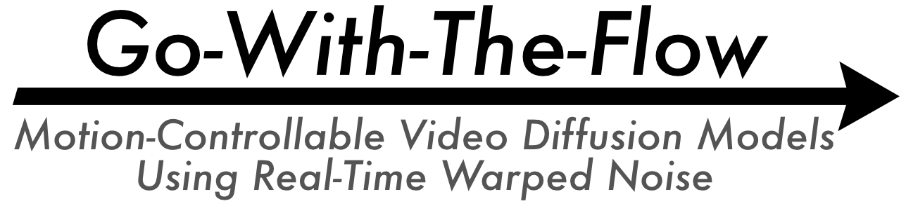

<!-- # Go-with-the-Flow: Motion-Controllable Video Diffusion Models Using Real-Time Warped Noise -->

<p align="center">
  
</p>

[](https://gowiththeflowpaper.github.io)
[](https://arxiv.org/abs/TODO)
[](https://www.youtube.com/watch?v=lt16s6tFOnI)
[](https://huggingface.co/VGenAI-Netflix-Eyeline-Research/Go-with-the-Flow)

[Ryan Burgert](https://vgenai-netflix-eyeline-research.github.io/Go-with-the-Flow/)<sup>1,3</sup>, [Yuancheng Xu](https://yuancheng-xu.github.io)<sup>1,4</sup>, [Wenqi Xian](https://www.cs.cornell.edu/~wenqixian/)<sup>1</sup>, [Oliver Pilarski](https://www.linkedin.com/in/oliverpilarski/)<sup>1</sup>, [Pascal Clausen](https://www.linkedin.com/in/pascal-clausen-a179566a/?originalSubdomain=ch)<sup>1</sup>, [Mingming He](https://mingminghe.com/)<sup>1</sup>, [Li Ma](https://limacv.github.io/homepage/)<sup>1</sup>, [Yitong Deng](https://yitongdeng.github.io)<sup>2,5</sup>, [Lingxiao Li](https://scholar.google.com/citations?user=rxQDLWcAAAAJ&hl=en)<sup>2</sup>, [Mohsen Mousavi](www.linkedin.com/in/mohsen-mousavi-0516a03)<sup>1</sup>, [Michael Ryoo](http://michaelryoo.com)<sup>3</sup>, [Paul Debevec](https://www.pauldebevec.com)<sup>1</sup>, [Ning Yu](https://ningyu1991.github.io)<sup>1†</sup>

<sup>1</sup>Netflix Eyeline Studios, <sup>2</sup>Netflix, <sup>3</sup>Stony Brook University, <sup>4</sup>University of Maryland, <sup>5</sup>Stanford University<br>
<sup>†</sup>Project Lead

### Table of Contents
- [Abstract](#abstract) 
- [Quick Start: Cut-and-drag Motion Control](#quick-start-cut-and-drag-motion-control)
  - [Animation Template GUI (Local)](#1-animation-template-gui-local) 
  - [Running Video Diffusion (GPU)](#2-running-video-diffusion-gpu)
- [TODO](#todo)  
- [Citation](#citation)

<a name="abstract"></a>
## :book: Abstract 

Go-with-the-Flow is an easy and efficient way to control the motion patterns of video diffusion models. It lets a user decide how the camera and objects in a scene will move, and can even let you transfer motion patterns from one video to another.

We simply fine-tune a base model — requiring no changes to the original pipeline or architecture, except: instead of using pure i.i.d. Gaussian noise, we use **warped noise** instead. Inference has exactly the same computational cost as running the base model.

<a name="quick-start-cut-and-drag-motion-control"></a>
## :rocket: Quick Start: Cut-and-drag Motion Control

Cut-and-drag motion control lets you take an image, and create a video by cutting out different parts of that image and dragging them around.

For cut-and-drag motion control, there are two parts: an GUI to create a crude animation (no GPU needed), then a diffusion script to turn that crude animation into a pretty one (requires GPU).

**YouTube Tutorial**: [](https://www.youtube.com/watch?v=lt16s6tFOnI)

Examples:

<p align="center">
  
  <!--  -->
  
  
  
</p>

<a name="1-animation-template-gui-local"></a>
### 1. Animation Template GUI (Local)

1. Clone this repo, then `cd` into it.  
2. Install local requirements:

    `pip install -r requirements_local.txt`

3. Run the GUI:

    `python cut_and_drag_gui.py`

4. Follow the instructions shown in the GUI.  

After completion, an MP4 file will be generated. You'll need to move this file to a computer with a decent GPU to continue.

<a name="2-running-video-diffusion-gpu"></a>
### 2. Running Video Diffusion (GPU)

1. Clone this repo on the machine with the GPU, then `cd` into it.  
2. Install requirements:

    `pip install -r requirements.txt`

3. Warp the noise (replace `<PATH TO VIDEO OR URL>` accordingly):

    `python make_warped_noise.py <PATH TO VIDEO OR URL> --output_folder noise_warp_output_folder`

4. Run inference:

    ```
    python cut_and_drag_inference.py noise_warp_output_folder \
        --prompt "A duck splashing" \
        --output_mp4_path "output.mp4" \
        --device "cuda" \
        --num_inference_steps 5
    ```

Adjust folder paths, prompts, and other hyperparameters as needed. The output will be saved as `output.mp4`.

<a name="todo"></a>
## :clipboard: TODO

- [x] Upload All Models
- [x] Upload Cut-And-Drag Inference Code  
- [x] Release to Arxiv
- [ ] Depth-Warping Inference Code
- [ ] T2V Motion Transfer Code
- [ ] ComfyUI Node
- [ ] Replicate Instance
- [ ] Fine-Tuning Code

<a name="citation"></a>
## :black_nib: Citation

If you use this in your research, please consider citing:

    @misc{gowiththeflow2025,
      title={Go-with-the-Flow: Motion-Controllable Video Diffusion Models Using Real-Time Warped Noise},
      author={Ryan Burgert and Yuancheng Xu and Wenqi Xian and Oliver Pilarski and Pascal Clausen and Mingming He and Li Ma and Yitong Deng and Lingxiao Li and Mohsen Mousavi and Michael Ryoo and Paul Debevec and Ning Yu},
      year={2025},
      howpublished={\url{https://vgenai-netflix-eyeline-research.github.io/Go-with-the-Flow/}},
    }
